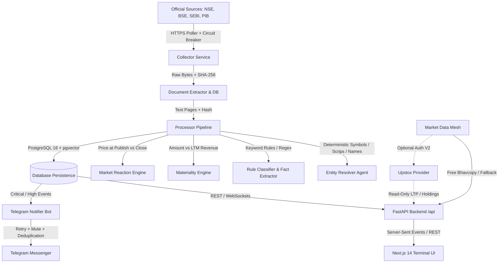

# India Market AI Research Terminal — Architecture Specification

> **Version:** 1.0 (Phase 17 Hardened)  
> **Source of Truth:** FINAL BUILD SPECIFICATION  
> **Design Axiom:** Personal-use, zero-budget, local-first Indian equity research terminal.

---

## 1. System Topology

---

## 2. Core Subsystems

### 2.1 Complete End-to-End Pipeline
Every item flows through a strict deterministic pipeline:
1. **Source Capture:** Ingestion poller captures raw payloads (JSON or PDF) from registered endpoints.
2. **Checksum & Deduplication:** Content SHA-256 hash is computed. If the same document or source item has already been ingested, it is idempotently returned without duplicate database writes.
3. **Document Extraction:** PyMuPDF extracts text per page with character quality checks.
4. **Entity Resolution:** Company is identified deterministically via bracketed symbols `[LT]`, BSE scrip codes `[500510]`, or legal name matching against the dynamic universe.
5. **Event Classification:** Classified into 45+ event categories (`ORDER_WIN`, `INSOLVENCY`, `MNA`, `CAPEX`, etc.).
6. **Materiality Triage:** Stated amounts are parsed to INR and evaluated against LTM revenue (>25% CRITICAL, >5% HIGH).
7. **Market Reaction:** Same-day price change, 20D volume multiple, gap percentage, and multi-day reactions are computed.
8. **Persistence:** Events, facts, documents, snapshots, and alert records are written with foreign key relationships.

### 2.2 Dynamic NSE + BSE Universe Engine
- Canonical identifier: **ISIN** (`INE...`).
- Dual-exchange mapping: Single company identity with multiple securities (`NSE: LT`, `BSE: 500510`).
- Mutation tracking: Detects new listings, symbol changes, and suspended/delisted history, emitting `UniverseChangeEvent`.

### 2.3 Market Data Mesh & Upstox Integration
- Abstract `MarketDataProvider` interface:
  - `get_quote()`, `get_quotes()`
  - `get_historical_candles()`, `get_intraday_candles()`
  - `get_market_status()`
  - `get_holdings()`, `get_positions()`
- **Free Provider (Default):** Consumes official NSE Bhavcopy and Yahoo Finance.
- **Upstox Provider (Optional):** Strictly read-only for live ticks and personal holdings monitoring. **Zero automated trading or order execution.**

### 2.4 Deterministic Technical Analysis
- `TechnicalSignalEngine` computes indicators without LLMs:
  - SMA (20, 50, 200)
  - EMA (12, 26, 50, 200)
  - RSI (14-period Wilder smoothing)
  - MACD (12, 26, 9)
  - Bollinger Bands (20-period, 2-std)
  - ATR (14-period)
  - ADX (14-period)
  - Volume moving averages & 20D spike detection
  - 52-Week High/Low distance

### 2.6 Document Diff & Filing Comparison
- `DocumentDiffEngine` in `packages/documents/diff.py`:
  - Section segmentation by Markdown headers and corporate report titles
  - Numerical delta detection (extracts monetary/percentage values and computes shift)
  - Forward-looking guidance shift detection (keyword analysis for guidance, outlook, targets)
  - Structured output (`PREVIOUS`, `CURRENT`, `CHANGE`) to eliminate redundant LLM processing

### 2.7 Corporate Actions Calendar
- `apps/api/routers/calendar.py`:
  - Consolidated event calendar for dividends, bonus issues, stock splits, buybacks, board meetings, and AGMs
  - Multi-criteria filtering by symbol, action type, and date window

### 2.8 Company Comparison Engine
- `apps/api/routers/compare.py`:
  - Side-by-side comparative matrices across 2–5 companies concurrently
  - Valuation ratios (P/E, P/B, EV/EBITDA, Market Cap)
  - Profitability & Return metrics (EBITDA margin, PAT margin, ROE, ROCE)
  - Balance sheet leverage (Debt/Equity) and technical signals (RSI, 52W high distance)
  - Strict non-advisory stance: zero investment winners or ratings generated

### 2.9 Global Unified Search
- `apps/api/routers/search.py`:
  - Fast unified multi-entity search across listed companies, securities, BSE scrips, ISINs, corporate events, and industry sectors

### 2.10 Paper Trading & Research Simulator
- `apps/api/routers/simulator.py`:
  - Virtual cash ledger (Rs 10,00,000 initial balance)
  - Simulated BUY/SELL order execution with realistic slippage (0.05%) and statutory turnover fees
  - Real-time P&L tracking, unrealized gain/loss, and portfolio drawdown calculation
  - Strictly labeled: PAPER / SIMULATION ONLY. Zero brokerage order execution.

### 2.11 Research Lab & Pluggable Forecasting
- `packages/market_data/forecasting.py` & `apps/api/routers/lab.py`:
  - Quantitative event-study backtester evaluating historical 1D, 5D, 10D, 20D event outcomes
  - Calculates Sharpe Ratio, Sortino Ratio, Win/Loss Rate, and Max Drawdown with transaction costs
  - Lightweight CPU-friendly Holt-Winters double exponential smoothing with 80% and 95% prediction intervals
  - Memory-efficient footprint (<50MB RAM), respecting 4GB VRAM hardware bounds

---

## 3. Security & Boundary Guardrails

1. **Broker Credentials:** `UPSTOX_CLIENT_SECRET` and access tokens are backend-only. Never sent to frontend, never printed in logs, never sent to an LLM.
2. **Trading Prohibition:** The codebase contains no order placement, algorithmic trading, or portfolio rebalancing logic.
3. **No Advisory Language:** All alerts and terminal views explicitly prohibit buy/sell recommendations and strictly state: `_Factual market intelligence only. Strictly non-advisory._`.
